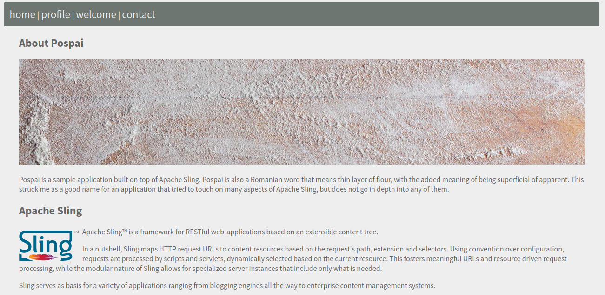

# Pospai

Pospai is a sample application built on top of Apache Sling. Pospai is also a Romanian word that means thin layer of flour, with the added meaning of being superficial or apparent. This struck me as a good name for an application that tried to touch on many aspects of Apache Sling, but does not go in depth into any of them.

  

## Organisation

The code for the application is spread between 

- [core](core), containing custom Java implementations such as [Sling Models](https://sling.apache.org/documentation/bundles/models.html), [Sling Servlets](https://sling.apache.org/documentation/the-sling-engine/servlets.html)
- [ui.apps](ui.apps), containing [HTL rendering scripts](https://sling.apache.org/documentation/bundles/scripting/scripting-htl.html) and the default application content

Packaging and deployment are handled in the following modules

- [launcher](launcher), containing a set of [OSGi Feature Model files](https://sling.apache.org/documentation/development/feature-model.html)
- [ui.users](ui.users), containing a set of sample users and groups
- [container](container), which produces a container image using the [docker-maven-plugin](https://dmp.fabric8.io/)
- [rpm](rpm), which produces an RPM package using the [rpm-maven-plugin](https://www.mojohaus.org/rpm-maven-plugin/)

Additionally, a sample Kubernets deploment is using [Kustomize](https://kustomize.io/) is present under [deploy/kubernetes](deploy/kubernetes).